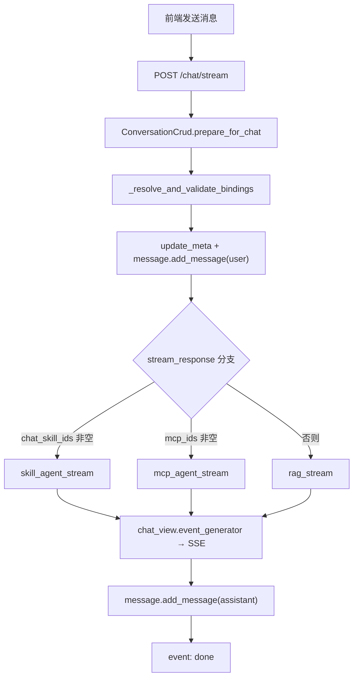
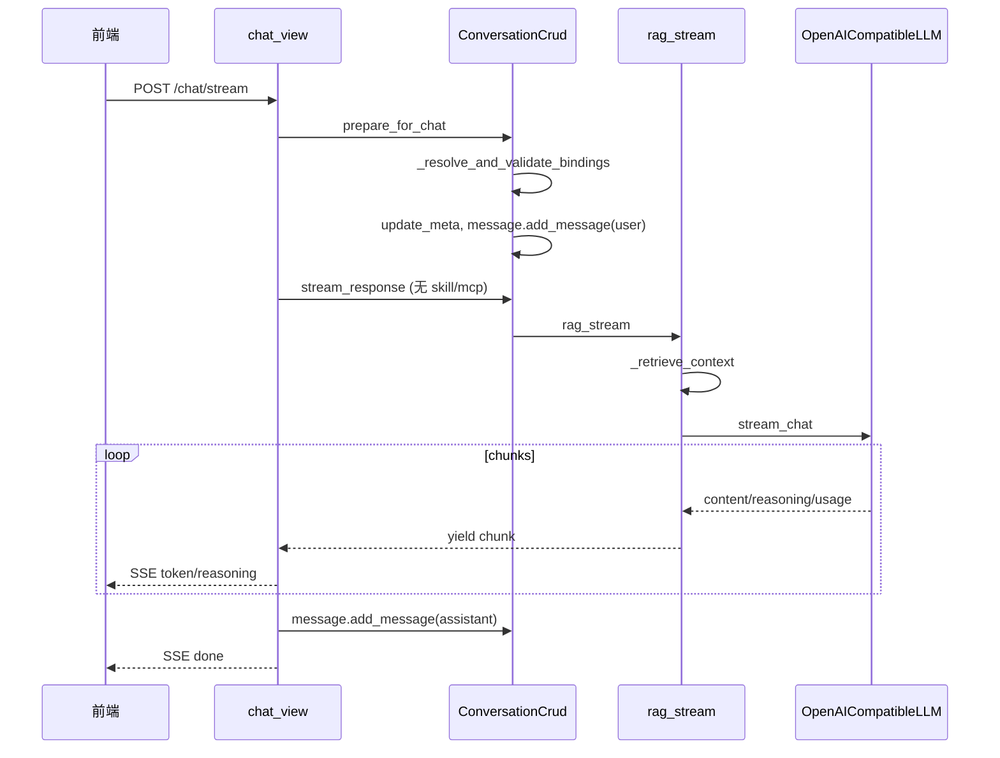
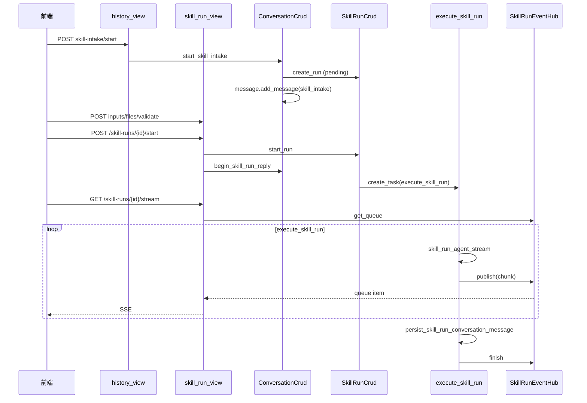

# 智能聊天后端执行链路文档

> 版本：2026-06-25（对齐 binding 合并重构与 E2E 验证）  
> 范围：`/chat/stream`、会话绑定、Skill 收集（wizard/async_job）、Skill Run 执行  
> 目标：按 **入口 → 编排 → 执行 → 出口** 梳理每种对话模式对应的后端逻辑，便于对照代码阅读。

---

## 1. 对话模式总览

| 模式 | 前端特征 | 主 HTTP 入口 | 核心执行函数 | SSE 出口 |
|------|----------|--------------|--------------|----------|
| **A. 普通聊天 / RAG** | 无 Skill、无 MCP，可选 KB、深度思考 | `POST /chat/stream` | `rag_stream` | `/chat/stream` |
| **B. MCP 工具聊天** | 选中 MCP 服务 | `POST /chat/stream` | `mcp_agent_stream` | `/chat/stream` |
| **C. Chat Skill** | 选中 `interaction_mode=chat` 的 Skill | `POST /chat/stream` | `skill_agent_stream` | `/chat/stream` |
| **D. Wizard Skill（收集+执行）** | Skill 向导面板、多步表单 | 收集：`POST .../skill-intake/start` 等；执行：`POST /skill-runs/{id}/start` | `skill_run_agent_stream` | 执行：`GET /skill-runs/{id}/stream` |
| **E. Async Job Skill** | 异步任务 Skill | 同 D 的收集链路；执行走 Celery | `execute_skill_run`（无 SSE） | 轮询 `GET /skill-runs/{id}` |
| **F. 会话绑定同步** | 切换 KB/模型/MCP/Skill/深度思考 | `PUT /conversations/{id}/bindings` | 仅写 meta，不生成 | JSON 响应 |

**分支优先级（`stream_response`）**：Chat Skill **>** MCP **>** 普通 RAG。三者互斥于「一次流式请求」内；Skill 与 MCP 在绑定层亦互斥。

---

## 2. 粘性状态与依赖

### 2.1 三层持久化

```
Conversation（会话级绑定）
├── knowledge_base_ids
├── skill_ids          ← chat + wizard 技能 ID 均存于此，运行时按 mode 拆分
├── mcp_ids
├── model_config_id
└── enable_thinking

Message（消息级状态）
├── skill_intake       ← wizard/async 收集面板（phase、form_values、run_id…）
└── skill_run_ref      ← 执行结果消息（run_id、status、链接）

SkillRun（Run 级草稿/执行）
├── status: pending | validated | running | completed | failed | cancelled
├── input_data / knowledge_base_ids / model_config_id
└── conversation_id（可选，对话内 Run 绑定会话）
```

### 2.2 关键依赖规则

| 规则 | 实现位置 |
|------|----------|
| Skill 与 MCP 不能同时启用 | `_resolve_and_validate_bindings`（`prepare_for_chat`、`sync_conversation_bindings` 共用） |
| `skill_ids` 中 wizard/async 不参与 `/chat/stream` | `_partition_skill_ids` → 仅 `chat_skill_ids` 传入 `stream_response` |
| wizard Skill 不能走 `/chat/stream` | `_resolve_and_validate_bindings` 校验 `mode != "chat"` 时报错 |
| 收集阶段换模型/KB 同步到 draft Run | `sync_conversation_bindings` → `_sync_active_skill_run_bindings` |
| Run 执行前再次从 Conversation 同步 model/KB | `execute_skill_run` 开头 |
| 深度思考 = 用户开关 ∧ 模型支持 | `llm_connection.resolve_effective_enable_thinking`；会话层持久化 `conv.enable_thinking` |

### 2.3 Skill 交互模式

| `interaction_mode` | 聊天流 | 收集向导 | Run 执行 |
|--------------------|--------|----------|----------|
| `chat`（默认） | ✅ `/chat/stream` | ❌ | ❌ |
| `wizard` | ❌ | ✅ | ✅ 进程内 + SSE |
| `async_job` | ❌ | ✅ | ✅ Celery，无 SSE |

### 2.4 重构后的辅助模块（2026-06-25）

| 模块 | 职责 |
|------|------|
| `conversation/services/binding_utils.py` | `kb_ids_from_conversation` / `skill_ids_from_conversation` / `mcp_ids_from_conversation`；`ResolvedConversationBindings` 数据类 |
| `conversation/services/skill_intake_helpers.py` | `freeze_intake_as_submitted`（启动 Run 前冻结 intake 面板） |
| `conversation/services/sse_helpers.py` | `merge_process_step`（chat SSE 与 Run SSE 共用 process_trace 去重合并） |
| `model_config/services/llm_connection.py` | `resolve_chat_llm_params`、`resolve_effective_enable_thinking` |
| `base/rag/llm.py` | `merge_token_usage`（MCP/Skill 多轮 token 累加） |

**包导入约定**：`conversation/services/__init__.py` **不做** eager import（避免 `skill_run_crud → binding_utils → conversation_crud` 循环依赖）。View / 依赖注入应直接从具体模块导入，例如 `from ...conversation_crud import ConversationCrud`。

---

## 3. 总决策图（流式问答）



---

## 4. 链路 A：普通聊天 / RAG（含 KB、深度思考）

**场景**：未选 Skill、未选 MCP；可选关联知识库；可选开启深度思考（需模型 `model_thinking=true`）。

### 4.1 调用链

| 阶段 | 文件 · 函数 | 说明 |
|------|-------------|------|
| **入口** | `conversation/views/chat_view.py` · `chat_stream` | `POST /chat/stream`，Body: `ChatRequest` |
| **编排** | `conversation/services/conversation_crud.py` · `prepare_for_chat` | 解析/创建会话；`_partition_skill_ids` 分离 wizard；`_resolve_and_validate_bindings`；`update_meta`；加载历史；`message.add_message(user)` |
| **编排** | 同上 · `stream_response` | `chat_skill_ids` 与 `mcp_ids` 均为空 → 走 RAG 分支 |
| **执行** | `base/rag/chain.py` · `rag_stream` | ① 无关问题短路 ② `_retrieve_context` ③ `_resolve_system_prompt` ④ `format_messages` ⑤ `OpenAICompatibleLLM.stream_chat` |
| **出口** | `chat_view.py` · `event_generator` | SSE：`meta` → `reasoning`/`token`/`process` → `done`；`message.add_message(assistant)` 持久化 |

### 4.2 序列图



### 4.3 深度思考在此链路中的生效点

```
req.enable_thinking
  → prepare_for_chat: resolve_effective_enable_thinking → conv.enable_thinking 持久化
  → stream_response: effective_thinking = resolve_effective_enable_thinking(model_config, req.enable_thinking)
  → rag_stream(..., enable_thinking=effective_thinking)
  → llm.stream_chat(..., enable_thinking=True)  # 模型返回 reasoning 流
```

---

## 5. 链路 B：MCP 工具聊天

**场景**：会话绑定一个或多个 MCP 服务；可与 KB 叠加；不可与 Chat Skill 同时启用。

### 5.1 调用链

| 阶段 | 文件 · 函数 | 说明 |
|------|-------------|------|
| **入口** | `chat_view.py` · `chat_stream` | 同 A |
| **编排** | `prepare_for_chat` | `_resolve_and_validate_bindings` 校验 MCP 访问；`chat_skill_ids` 必须为空 |
| **编排** | `stream_response` | `mcp_ids` 非空且 `skill_ids` 为空 → MCP 分支 |
| **执行** | `base/rag/mcp_agent.py` · `mcp_agent_stream` | 加载 MCP → KB 检索 → 多轮 `chat_with_tools` → 流式输出 |
| **过程数据** | `McpStep` + `merge_process_step` | view 层合并进 `process_trace` |
| **出口** | `chat_view.event_generator` | SSE + `message.add_message(process_trace=...)` |

### 5.2 MCP 工具循环（执行层细节）

```
for round in 1..MAX_MCP_TOOL_ROUNDS(6):
    completion = llm.chat_with_tools(messages, tools)
    if tool_calls:
        对每个 tool_call:
            yield process(running) → call_remote_tool → yield process(done|error)
            append tool result to messages
        continue
    else:
        流式输出 final content → yield process_trace → yield usage → return
```

---

## 6. 链路 C：Chat Skill 聊天

**场景**：选中 `interaction_mode=chat` 的 Skill；在对话中直接发消息，由 Skill 指令 + 可选工具驱动回答。

### 6.1 调用链

| 阶段 | 文件 · 函数 | 说明 |
|------|-------------|------|
| **入口** | `chat_view.py` · `chat_stream` | 请求可带 `skill_ids`；若省略则从 `conv.skill_ids` 经 `_partition_skill_ids` 取 chat 部分 |
| **编排** | `prepare_for_chat` | 校验：仅 1 个 chat Skill、`skill_key` 存在、`mode==chat`；`stored_skill_ids = wizard_ids + chat_ids` 写回会话 |
| **编排** | `stream_response` | **最高优先级**：`skill_ids and user and conversation_id` |
| **执行** | `base/rag/skill_agent.py` · `skill_agent_stream` | 加载 Skill → `ensure_chat_snapshot` → 按策略 `use_tools` → `_skill_agent_loop(chat_mode=True, include_write=False)` |
| **出口** | `chat_view.event_generator` | SSE；`merge_process_step` 维护 `process_trace` |

### 6.2 Chat 模式工具触发策略

```
tools_policy = skill.input_schema.chat_tools   # 默认 "on_demand"
use_tools =
    policy == "always"
    OR _question_needs_skill_tools(question)   # ping/checklist/glob 等正则
    OR skill 配置了 embedded MCP
```

普通闲聊不触发工具；联调类指令才进入 tool-calling 链路。

---

## 7. 链路 D：Wizard Skill（收集 → 启动 → SSE 执行）

**场景**：多步表单收集输入，提交后在对话内展示执行进度与结果。

### 7.1 阶段一：开始 / 恢复收集

| 阶段 | 文件 · 函数 | 说明 |
|------|-------------|------|
| **入口** | `history_view.py` · `start_skill_intake` | `POST /conversations/{id}/skill-intake/start` |
| **编排** | `ConversationCrud.start_skill_intake` | 校验 `mode in {wizard, async_job}`；解析 model/KB/thinking |
| **编排（恢复）** | 同上 | `get_active_draft` 且同 skill → 返回已有 `message_id` + `skill_intake` |
| **编排（新建）** | 同上 | `SkillRunCrud.create_run`（pending）→ `message.add_message(assistant, skill_intake=...)` → `update_meta(skill_ids=[skill_id], mcp_ids=[])` |
| **出口** | JSON | `SkillIntakeStartResult`（`run_id`, `message_id`, `skill_intake`, `resumed`） |

### 7.2 阶段二：收集过程（辅助 API）

| 操作 | 入口 | 编排 | 出口 |
|------|------|------|------|
| 保存字段 | `POST /skill-runs/{id}/inputs` | `SkillRunCrud.save_inputs` → 合并 `input_data` | JSON `SkillRunOut` |
| 上传文件 | `POST /skill-runs/{id}/files` | `save_upload` → 工作区 `input/` | JSON 路径 |
| 校验 | `POST /skill-runs/{id}/validate` | `validate_run_inputs` | `missing_fields` |
| 更新面板 UI 状态 | `PUT .../messages/{id}/skill-intake` | `MessageCrud.update_skill_intake` | JSON `MessageOut` |
| 查询 draft | `GET /skill-runs/active-draft?conversation_id=` | `get_active_draft` | JSON |

**校验要点（wizard 四步示例 `test_wizard_skill`）**：`source`(file) + `project_name`(text) + `style`(choice: 简洁/详细) + `confirmed`(confirm: true)。缺 `style` 时 validate 返回「报告风格：缺少选择项」。

### 7.3 阶段三：启动执行

| 阶段 | 文件 · 函数 | 说明 |
|------|-------------|------|
| **入口** | `skill_run_view.py` · `start_skill_run` | `POST /skill-runs/{run_id}/start` |
| **编排** | `SkillRunCrud.start_run` | `validate_run` → `ensure_skill_snapshot` → **wizard**: `asyncio.create_task(execute_skill_run)` |
| **编排** | `ConversationCrud.begin_skill_run_reply` | `freeze_intake_as_submitted` 冻结 intake；创建 execution 消息（`skill_run_ref`，占位文案） |
| **出口** | JSON | `SkillRunStartResult`（`execution_message_id`, `async_execution=false`） |

### 7.4 阶段四：SSE 订阅执行进度

| 阶段 | 文件 · 函数 | 说明 |
|------|-------------|------|
| **入口** | `skill_run_view.py` · `stream_skill_run` | `GET /skill-runs/{run_id}/stream` |
| **编排** | `SkillRunEventHub.get_queue(run_id)` | 订阅内存队列（同进程） |
| **执行** | `skill_run_executor.py` · `execute_skill_run` | 见 7.5 |
| **出口** | SSE | `meta` / `reasoning` / `token` / `process` / `done` / `error`；`merge_process_step` 合并步骤 |

**边界**：若 Run 在 SSE 连接前已结束，stream 可能无事件；应以 `GET /skill-runs/{id}` 与 execution 消息为准。

### 7.5 执行层（wizard / async 共用核心）

| 阶段 | 文件 · 函数 | 说明 |
|------|-------------|------|
| **执行** | `skill_run_executor.py` · `execute_skill_run` | status→running；`kb_ids_from_conversation`；`resolve_effective_enable_thinking` |
| **执行** | `skill_agent.py` · `skill_run_agent_stream` | `WorkspaceService` 工作区；`_skill_agent_loop(include_write=True, output_prefix=output/)` |
| **事件** | `SkillRunEventHub.publish` | wizard：`publish_events=True`；每个 chunk 推入队列 |
| **持久化** | `persist_skill_run_conversation_message` | 更新 execution 消息：正文、usage、`process_trace`、`skill_run_ref` |
| **结束** | `SkillRunEventHub.finish` + `cleanup` | 关闭队列 |



---

## 8. 链路 E：Async Job Skill

与 Wizard **收集阶段完全相同**（链路 D 阶段一、二）。差异仅在 `start_run`：

| 阶段 | 文件 · 函数 | 说明 |
|------|-------------|------|
| **入口** | `skill_run_view.start_skill_run` | 同 D |
| **编排** | `SkillRunCrud.start_run` | `mode == async_job` → `execute_skill_run_async.delay(...)` |
| **编排** | `begin_skill_run_reply` | `is_async=True` → 占位文案「异步任务已提交…」 |
| **执行** | `celery_scheduler/tasks/task_run_skill.py` · `execute_skill_run_async` | Celery worker 内 `run_async(execute_skill_run(..., publish_events=False))` |
| **出口** | 无 SSE | `stream_skill_run` 返回「async_job 模式请轮询 Run 详情」；前端轮询 `GET /skill-runs/{id}` |
| **持久化** | `persist_skill_run_conversation_message` | Celery 完成后仍写入对话 execution 消息 |

**Celery 启动**（项目根目录，需 Redis + worker）：

```bash
celery -A backend.celery_scheduler.celery_worker worker -Q default --pool=solo -l INFO
```

**验证样例（`test_async_job_skill`）**：产物 `summary.json` + `metrics.json` + `status.txt`（含 `TEST_ASYNC_OK`）。

---

## 9. 链路 F：会话绑定同步（不生成回复）

**场景**：用户切换知识库、模型、MCP、Chat Skill、深度思考开关；不产生 LLM 调用。

| 阶段 | 文件 · 函数 | 说明 |
|------|-------------|------|
| **入口** | `history_view.py` · `sync_conversation_bindings` | `PUT /conversations/{id}/bindings` |
| **编排** | `ConversationCrud.sync_conversation_bindings` | 调用 `_resolve_and_validate_bindings`（与 `prepare_for_chat` 共用校验逻辑） |
| **编排** | `_sync_active_skill_run_bindings` | 若存在 draft Run，同步 `model_config_id`、`knowledge_base_ids` |
| **执行** | `update_meta` | 仅 UPDATE 会话表 |
| **出口** | JSON | `ConversationOut` |

---

## 10. SSE 事件对照（出口格式）

### 10.1 `POST /chat/stream`

| event | 含义 | 来源 chunk.type |
|-------|------|-----------------|
| `meta` | `conversation_id` | 固定首包 |
| `reasoning` | 深度思考 token | `reasoning` |
| `token` | 正文 token | `content` |
| `process` | 工具步骤 | `process`（经 `merge_process_step` 去重） |
| `error` | 异常 | except |
| `done` | 结束 + usage + process_trace | 生成器末尾 |

### 10.2 `GET /skill-runs/{id}/stream`

| event | 含义 |
|-------|------|
| `meta` | `run_id`, `status` |
| `reasoning` / `token` / `process` | 同 chat（共用 `merge_process_step`） |
| `error` | 失败或取消 |
| `done` | `content`, `run_id`, `status`, `usage` |

---

## 11. 文件索引（按职责）

| 职责 | 路径 |
|------|------|
| 聊天 SSE 入口 | `applications/conversation/views/chat_view.py` |
| 会话 / 收集 API | `applications/conversation/views/history_view.py` |
| 会话编排核心 | `applications/conversation/services/conversation_crud.py` |
| 绑定 ID 读取 / 解析结果 | `applications/conversation/services/binding_utils.py` |
| intake 冻结 / SSE 合并 | `skill_intake_helpers.py` / `sse_helpers.py` |
| Skill Run API | `applications/agent/views/skill_run_view.py` |
| Run CRUD / 启动 | `applications/agent/services/skill_run_crud.py` |
| Run 执行器 | `applications/agent/services/skill_run_executor.py` |
| Run SSE 总线 | `applications/agent/services/skill_run_events.py` |
| RAG 流 | `applications/base/rag/chain.py` |
| MCP Agent | `applications/base/rag/mcp_agent.py` |
| Skill Agent（chat + run 共用 loop） | `applications/base/rag/skill_agent.py` |
| LLM 连接 / 深度思考 | `applications/model_config/services/llm_connection.py` |
| 异步任务 | `celery_scheduler/tasks/task_run_skill.py` |
| 路由挂载 | `core/initializations/app_initialization.py` |

---

## 12. 模式组合矩阵（运行时）

| KB | MCP | Chat Skill | Wizard Skill | 发 `/chat/stream` 走 | 备注 |
|----|-----|------------|--------------|----------------------|------|
| ✅ | ❌ | ❌ | ❌ | RAG | 纯检索增强 |
| ✅ | ✅ | ❌ | ❌ | MCP | KB 作 system 上下文 |
| ✅ | ❌ | ✅ | ❌ | Chat Skill | KB + Skill 指令 |
| ✅ | ❌ | ❌ | ✅（收集中） | ❌ 应走 intake/start | wizard 不参与 stream 分支 |
| ❌ | ✅ | ✅ | ❌ | **禁止** | prepare 抛错 |
| 任意 | 任意 | 任意 | 收集中 | bindings 同步 Run | 不换 Skill 类型 |

---

## 13. 实现要点与简评

### 13.1 设计合理之处

- **单一 SSE 聊天入口**（`/chat/stream`）+ **Run 独立 SSE**，职责清晰。
- **`_partition_skill_ids` + `_resolve_and_validate_bindings`** 解决 wizard Skill 与 chat 流式路径冲突，且 bindings 与 chat 共用校验。
- **`begin_skill_run_reply` + `persist_skill_run_conversation_message`** 统一 execution 消息生命周期。
- **深度思考** 用户意图（`conv.enable_thinking`）与模型能力（`model_thinking`）在 `llm_connection` 单点计算。
- **纯函数辅助模块**（binding / intake / sse）降低 `conversation_crud` 内重复，且不触发包级循环 import。

### 13.2 需注意的边界

- `SkillRunEventHub` 为进程内队列，多 worker 部署时 SSE 须 sticky 到执行进程，或改为 Redis 等外部总线。
- `async_job` 无 SSE，依赖轮询；与 wizard 共用 executor 但 `publish_events=False`。
- `prepare_for_chat` 每次发消息都会 `add_message(user)` 并 `update_meta`，属于「发即绑定」语义。
- wizard Run 极快完成时，SSE 可能空连接；以 Run 详情与 execution 消息为准。

### 13.3 当前分层（2026-06-25 重构后）

| 层级 | 典型位置 | 评价 |
|------|----------|------|
| View | `chat_view.event_generator`、`skill_run_view.stream_skill_run` | 薄：SSE 映射 + 直接 `message.add_message` |
| CRUD 编排 | `ConversationCrud.prepare_for_chat`、`stream_response`、`start_skill_intake`、`begin_skill_run_reply` | 核心编排仍集中，约 850 行 |
| 纯辅助 | `binding_utils`、`skill_intake_helpers`、`sse_helpers`、`llm_connection` | 已抽出，避免碎函数 wrapper |
| Agent 执行 | `rag_stream`、`mcp_agent_stream`、`_skill_agent_loop` | LLM/工具逻辑，接口应稳定 |
| 跨模块持久化 | `persist_skill_run_conversation_message` lazy import `ConversationCrud` | 仍保留，避免 executor ↔ crud 顶格循环 import |

**新增模式建议**：优先在 `stream_response` 增加明确分支；Run 持久化保持 `skill_run_executor` 单点出口；bindings 校验扩展 `_resolve_and_validate_bindings` 而非复制。

---

## 14. 快速定位：「我发的这条消息走后端哪条路？」

```
1. 是否 wizard/async 收集面板中的提交？
   → 否，继续
2. POST /chat/stream
3. prepare_for_chat 得到的 chat_skill_ids 非空？
   → 是 → 链路 C（Chat Skill）
4. mcp_ids 非空？
   → 是 → 链路 B（MCP）
5. 否则 → 链路 A（RAG），KB 仅影响检索与 system prompt

若用户在 Skill 向导里：
   start → inputs/files/validate → start_run → stream（wizard）或 poll（async_job）
```

---

## 15. E2E 验证基准（2026-06-25）

| 链路 | 样例 Skill | 关键断言 |
|------|------------|----------|
| Wizard 全流程 | `test_wizard_skill` | validate 通过 → start → `completed`；`report.md` + `metrics.json`；execution 消息含 `TEST_WIZARD_OK` |
| Async Celery | `test_async_job_skill` | `async_execution=true`；SSE 拒绝；轮询 `completed`；`status.txt` 含 `TEST_ASYNC_OK` |
| Chat Skill | `test_chat_skill` | 普通题无 tool 步骤；`ping` 含 `TEST_CHAT_OK` |

---

*文档与代码同步基准：`conversation_crud.stream_response` 三分支优先级；`SkillRunCrud.RUN_MODES = {wizard, async_job}`；`resolve_effective_enable_thinking` 位于 `llm_connection.py`。*
