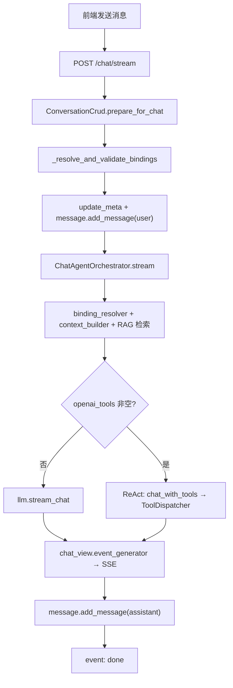
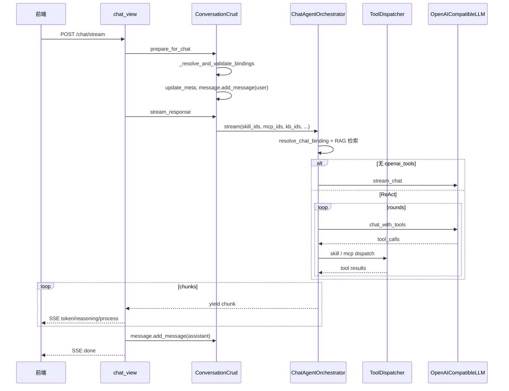
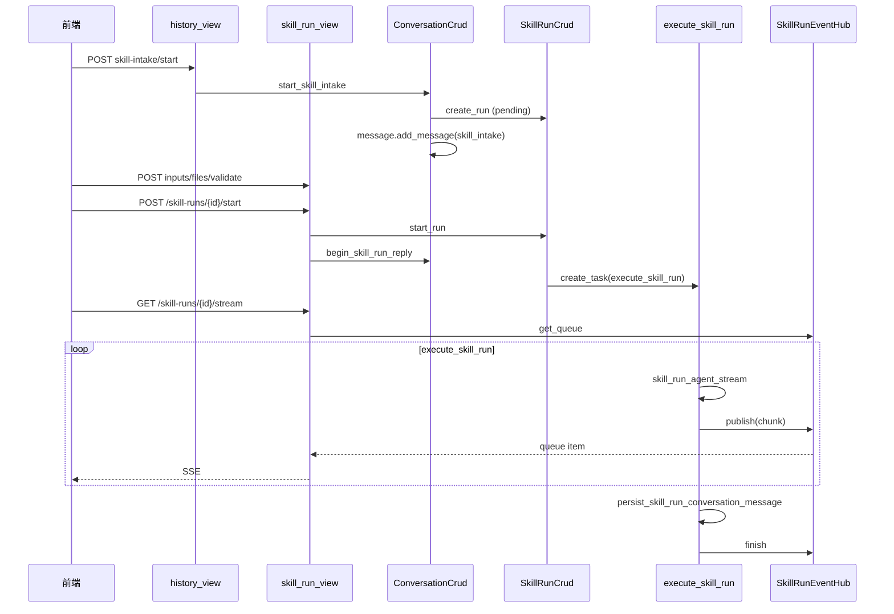

# 智能聊天执行链路文档

> 版本：2026-06-29（RAG Sprint 2：`retriever` + Rerank + sources 持久化）  
> 范围：前端 `智能聊天` 页、后端 `/chat/stream`、会话绑定、Skill 收集与 Run 执行  
> 关联：`MCP_INTEGRATION.md`（MCP 专项）、`HYBRID_AGENT_ORCHESTRATION.md`（架构决策）、`RAG_RETRIEVAL_QUALITY.md`（检索质量）  
> 读法：**先看 §0 导读 → §1 模式 → §2 前端 → §3 决策图 → 按需查 §4～§7 链路细节 → § 维护速查**

---

## 0. 给维护者的小白导读

### 0.1 智能聊天是什么？

「智能聊天」页（前端 `views/chat/index.vue`）是 **一个会话界面、三条后端路径**：

| 用户操作 | 后端路径 | 一句话 |
|----------|----------|--------|
| 输入框发消息 | `POST /chat/stream` | 混合助手：可选 KB + chat Skill + MCP，**同一条** ReAct 运行时 |
| 「Skill 任务」向导填表提交 | `skill-intake/*` → `skill-runs/*` | wizard/async 结构化任务，**不走** `/chat/stream` |
| 切换 KB / 模型 / Skill / MCP | `PUT /conversations/{id}/bindings` | 只改会话绑定，**不调用 LLM** |

**核心原则（2026-06-26）：** 普通聊天不再按 RAG / Skill / MCP 分三条后端分支；全部汇总到 `ChatAgentOrchestrator`。Wizard/Async 仍是独立的 Run 流水线。

### 0.2 三层代码怎么分工？

```text
┌─────────────────────────────────────────────────────────────┐
│ 前端 views/chat/index.vue                                    │
│  三个 Picker + sendMessage + SkillIntakePanel + SSE 解析     │
└───────────────────────────┬─────────────────────────────────┘
                            │ HTTP / SSE
┌───────────────────────────▼─────────────────────────────────┐
│ 会话层 conversation/                                         │
│  prepare_for_chat · stream_response · bindings · intake      │
└───────────────────────────┬─────────────────────────────────┘
                            │
        ┌───────────────────┴───────────────────┐
        │                                       │
┌───────▼────────┐                    ┌─────────▼──────────┐
│ /chat/stream   │                    │ skill-runs/*       │
│ ChatAgent      │                    │ execute_skill_run  │
│ Orchestrator   │◄── run_mode=True ──│ → 同一 Orchestrator│
└────────────────┘                    └────────────────────┘
```

### 0.3 维护速查（改哪里）

| 你想改… | 优先看 |
|---------|--------|
| RAG 检索、Rerank、参考来源、空召回 | `retriever.py`、`reranker.py`、`chat_agent_orchestrator.py`、`MessageBubble.vue`；见 `RAG_RETRIEVAL_QUALITY.md` |
| 聊天 UI、Picker、发消息、SSE 展示 | `frontend/src/views/chat/index.vue`、`frontend/src/api/index.js`（`chatStream`） |
| 绑定校验（Skill 个数、wizard 禁 chat 等） | `conversation_crud.py` · `_resolve_and_validate_bindings`、`_partition_skill_ids` |
| 混合 ReAct、RAG 短路、工具轮次 | `chat_agent_orchestrator.py` |
| Skill/MCP 工具注册、内嵌 MCP 去重 | `binding_resolver.py` |
| Skill 文件工具 vs MCP `call_tool` | `tool_dispatcher.py` |
| System prompt 拼装 | `context_builder.py` |
| MCP 连接、审计、取消 | `applications/mcp/`（见 `MCP_INTEGRATION.md`） |
| Wizard 表单、提交、Run SSE | `SkillIntakePanel.vue`、`skill_run_view.py`、`skill_run_executor.py` |
| 深度思考 / 模型参数 | `llm_connection.py` · `resolve_effective_enable_thinking` |

---

## 1. 对话模式总览

| 模式 | 前端特征 | 主 HTTP 入口 | 核心执行函数 | SSE 出口 |
|------|----------|--------------|--------------|----------|
| **A. 混合聊天（RAG + Skill + MCP）** | 可选 KB、chat Skill（单选）、MCP（多选）、深度思考 | `POST /chat/stream` | `ChatAgentOrchestrator.stream` | `/chat/stream` |
| **B. Wizard Skill（收集+执行）** | Skill 向导面板、多步表单 | 收集：`POST .../skill-intake/start` 等；执行：`POST /skill-runs/{id}/start` | `skill_run_agent_stream` | 执行：`GET /skill-runs/{id}/stream` |
| **C. Async Job Skill** | 异步任务 Skill | 同 B 的收集链路；执行走 Celery | `execute_skill_run`（无 SSE） | 轮询 `GET /skill-runs/{id}` |
| **D. 会话绑定同步** | 切换 KB/模型/MCP/Skill/深度思考 | `PUT /conversations/{id}/bindings` | 仅写 meta，不生成 | JSON 响应 |

**`/chat/stream` 路由（2026-06-26）**：`stream_response` **始终** 走 `ChatAgentOrchestrator`；无 Skill/MCP 时等价于纯 RAG（含无关问题短路）。Skill 与 MCP **可同时绑定**（1 chat Skill + N MCP）。

### 1.1 前端三个入口（`views/chat/index.vue`）

| UI 控件 | 绑定状态 | 触发的 API | 说明 |
|---------|----------|------------|------|
| 选择知识库 | `selectedKBs` | `PUT .../bindings`（防抖 300ms）+ `chatStream` 携带 `knowledge_base_ids` | 未选 KB 发消息会弹确认框 |
| 选择 Skill（魔杖） | `selectedSkills` | 同上 + `chatStream.skill_ids` | 仅列出 `interaction_mode=chat` 的 Skill |
| Skill 任务（流程） | `selectedWizardSkillTrigger` | `POST .../skill-intake/start` → 面板内 `skill-runs/*` | 仅 `wizard` / `async_job`；**锁定输入框**，收集期间 **禁用 MCP Picker** |
| 选择 MCP | `selectedMcps` | 同上 + `chatStream.mcp_ids` | 与 chat Skill **可同时选**；wizard 收集中 UI 禁用 |
| 深度思考 | `enableDeepThinking` | bindings + `chatStream.enable_thinking` | 仅当当前模型 `model_thinking=true` 时显示 |
| 模型 | `selectedModelConfig` | bindings + `chatStream.model_config_id` | |

**发消息逻辑（`sendMessage`）：**

1. 若存在 wizard 收集中（`skillIntakeLocked`），输入框不可用。  
2. 调用 `chatStream(...)` → `POST /chat/stream`；`skill_ids`：有 wizard 触发器时传 `null`（沿用会话里 chat Skill），否则传 `selectedSkills`。  
3. SSE：`meta` → `reasoning`/`token`/`process` → `done`；`AbortController` 断开即取消 fetch（MCP in-flight 见 `McpCancelScope`）。  
4. Wizard Run 启动后：`attachSkillRunStream` → `GET /skill-runs/{id}/stream`；async_job 则轮询 Run 详情。

---

## 2. 粘性状态与依赖

### 2.1 三层持久化

```
Conversation（会话级绑定）
├── knowledge_base_ids
├── skill_ids          ← chat + wizard 技能 ID 均存于此，运行时按 mode 拆分
├── mcp_ids
├── model_config_id
└── enable_thinking

Message（消息级状态）
├── skill_intake       ← wizard/async 收集面板（phase、form_values、run_id…）
└── skill_run_ref      ← 执行结果消息（run_id、status、链接）

SkillRun（Run 级草稿/执行）
├── status: pending | validated | running | completed | failed | cancelled
├── input_data / knowledge_base_ids / model_config_id
└── conversation_id（可选，对话内 Run 绑定会话）
```

### 2.2 关键依赖规则

| 规则 | 实现位置 |
|------|----------|
| Skill 与 MCP **可同时** 绑定（1 chat Skill + N MCP） | `_resolve_and_validate_bindings`（已移除互斥） |
| `skill_ids` 中 wizard/async 不参与 `/chat/stream` | `_partition_skill_ids` → 仅 `chat_skill_ids` 传入 `stream_response` |
| wizard Skill 不能走 `/chat/stream` | `_resolve_and_validate_bindings` 校验 `mode != "chat"` 时报错 |
| 收集阶段换模型/KB 同步到 draft Run | `sync_conversation_bindings` → `_sync_active_skill_run_bindings` |
| Run 执行前再次从 Conversation 同步 model/KB | `execute_skill_run` 开头 |
| 深度思考 = 用户开关 ∧ 模型支持 | `llm_connection.resolve_effective_enable_thinking`；会话层持久化 `conv.enable_thinking` |

### 2.3 Skill 交互模式

| `interaction_mode` | 聊天流 | 收集向导 | Run 执行 |
|--------------------|--------|----------|----------|
| `chat`（默认） | ✅ `/chat/stream` | ❌ | ❌ |
| `wizard` | ❌ | ✅ | ✅ 进程内 + SSE |
| `async_job` | ❌ | ✅ | ✅ Celery，无 SSE |

### 2.4 重构后的辅助模块（2026-06-25）

| 模块 | 职责 |
|------|------|
| `conversation/services/binding_utils.py` | `kb_ids_from_conversation` / `skill_ids_from_conversation` / `mcp_ids_from_conversation`；`ResolvedConversationBindings` 数据类 |
| `conversation/services/skill_intake_helpers.py` | `freeze_intake_as_submitted`（启动 Run 前冻结 intake 面板） |
| `conversation/services/sse_helpers.py` | `merge_process_step`（chat SSE 与 Run SSE 共用 process_trace 去重合并） |
| `model_config/services/llm_connection.py` | `resolve_chat_llm_params`、`resolve_effective_enable_thinking` |
| `base/rag/llm.py` | `merge_token_usage`（多轮 ReAct token 累加） |
| `agent/orchestrator/chat_agent_orchestrator.py` | 统一 Hybrid ReAct：RAG + Skill 工具 + MCP 工具 |
| `agent/orchestrator/binding_resolver.py` | 解析 Skill/MCP 绑定、内嵌 MCP 去重、OpenAI tools 注册；`run_mode=True` 时允许 wizard/async Skill |
| `agent/orchestrator/tool_dispatcher.py` | Skill 文件工具与 MCP `call_tool` 统一分发 |

**包导入约定**：`conversation/services/__init__.py` **不做** eager import（避免 `skill_run_crud → binding_utils → conversation_crud` 循环依赖）。View / 依赖注入应直接从具体模块导入，例如 `from ...conversation_crud import ConversationCrud`。

---

## 3. 总决策图（流式问答）



---

## 4. 链路 A：混合聊天（`/chat/stream`）

**场景**：所有通过 `/chat/stream` 的消息均走同一条 Runtime。可选 KB、chat Skill（1 个）、MCP（多个）、深度思考；组合方式由会话绑定决定，**不再** 按 Skill/MCP/RAG 三分支路由。

### 4.1 调用链

| 阶段 | 文件 · 函数 | 说明 |
|------|-------------|------|
| **入口** | `conversation/views/chat_view.py` · `chat_stream` | `POST /chat/stream`，Body: `ChatRequest` |
| **编排** | `conversation/services/conversation_crud.py` · `prepare_for_chat` | 解析/创建会话；`_partition_skill_ids`；`_resolve_and_validate_bindings`；`update_meta`；加载历史；`message.add_message(user)` |
| **编排** | 同上 · `stream_response` | **始终** `_chat_orchestrator.stream(...)` |
| **执行** | `agent/orchestrator/chat_agent_orchestrator.py` · `stream` | ① 无 Skill/MCP 且非 run 时，问候类走 `stream_irrelevant_response` ② `resolve_chat_binding(run_mode=False)` ③ RAG 检索 ④ `build_hybrid_system_prompt` ⑤ 无工具 → `stream_chat`；有工具 → ReAct + `McpSessionManager` + `ToolDispatcher` |
| **兼容入口** | `base/rag/skill_agent.py` · `skill_agent_stream` | 薄 delegate → 同上 Orchestrator（chat 模式） |
| **兼容入口** | `base/rag/chain.py` · `rag_stream` | 薄 delegate → 同上 Orchestrator（需 `user` 参数） |
| **出口** | `chat_view.py` · `event_generator` | SSE：`meta` → `reasoning`/`token`/`process` → `done`；`message.add_message(assistant)` 持久化 |

### 4.2 序列图



### 4.3 能力组合（同一 Runtime）

| 绑定 | 行为 |
|------|------|
| 仅 KB / 无绑定 | RAG 检索 + 流式 LLM；问候类问题走 `stream_irrelevant_response` 短路 |
| + MCP | 注册 MCP OpenAI tools；LLM 按需 `call_tool` |
| + chat Skill | 注入 SKILL.md 指令 + skill 文件工具（chat 模式 `allow_skill_write=False`） |
| Skill + MCP | 工具 registry 合并；`binding_resolver` 按 server.id 去重内嵌 MCP |
| 深度思考 | `resolve_effective_enable_thinking` → `llm.stream_chat` / `chat_with_tools` |

### 4.4 深度思考生效点

```
req.enable_thinking
  → prepare_for_chat: resolve_effective_enable_thinking → conv.enable_thinking 持久化
  → stream_response: effective_thinking = resolve_effective_enable_thinking(...)
  → ChatAgentOrchestrator.stream(..., enable_thinking=effective_thinking)
  → llm.stream_chat / chat_with_tools(..., enable_thinking=True)
```

### 4.5 `ChatAgentOrchestrator` 内部步骤（对照代码）

`chat_agent_orchestrator.py` · `_stream_impl` 顺序：

1. **短路**：无 Skill、无 MCP、非 Run → `is_irrelevant_question` → 固定寒暄 SSE。  
2. **绑定**：`resolve_chat_binding(run_mode=…)` → `openai_tools`、`tool_registry`、`mcp_servers`。  
3. **RAG**：`trim_chat_history`（M0）→ `retriever.retrieve()` → yield `sources` / `retrieval_empty` → `_resolve_system_prompt` → `build_hybrid_system_prompt` → `format_messages`（含 token 双限）。  
4. **无工具**：`llm.stream_chat` → 直接 token 流。  
5. **有工具**：`async with McpSessionManager` → `open_servers` → ReAct 循环（最多 `policy.max_tool_rounds`）：  
   - `llm.chat_with_tools`  
   - 有 `tool_calls` → `ToolDispatcher`（SkillStep / McpStep）→ 结果写回 messages  
   - 无 `tool_calls` → `_stream_final_answer`  
6. **收尾**：`process_trace` + `usage` chunk；外层 `CancelledError` → `McpCancelScope`。

策略默认值见 `HybridAgentPolicy`（`parallel_tool_calls`、`inject_resource_contents`、`audit_enabled` 等）；MCP 细节见 `MCP_INTEGRATION.md` §4.2。

---

## 5. 链路 B：Wizard Skill（收集 → 启动 → SSE 执行）

**场景**：多步表单收集输入，提交后在对话内展示执行进度与结果。

### 5.1 阶段一：开始 / 恢复收集

| 阶段 | 文件 · 函数 | 说明 |
|------|-------------|------|
| **入口** | `history_view.py` · `start_skill_intake` | `POST /conversations/{id}/skill-intake/start` |
| **编排** | `ConversationCrud.start_skill_intake` | 校验 `mode in {wizard, async_job}`；解析 model/KB/thinking |
| **编排（恢复）** | 同上 | `get_active_draft` 且同 skill → 返回已有 `message_id` + `skill_intake` |
| **编排（新建）** | 同上 | `SkillRunCrud.create_run`（pending）→ `message.add_message(assistant, skill_intake=...)` → `update_meta(skill_ids=[skill_id], mcp_ids=[])` |
| **出口** | JSON | `SkillIntakeStartResult`（`run_id`, `message_id`, `skill_intake`, `resumed`） |

### 5.2 阶段二：收集过程（辅助 API）

| 操作 | 入口 | 编排 | 出口 |
|------|------|------|------|
| 保存字段 | `POST /skill-runs/{id}/inputs` | `SkillRunCrud.save_inputs` → 合并 `input_data` | JSON `SkillRunOut` |
| 上传文件 | `POST /skill-runs/{id}/files` | `save_upload` → 工作区 `input/` | JSON 路径 |
| 校验 | `POST /skill-runs/{id}/validate` | `validate_run_inputs` | `missing_fields` |
| 更新面板 UI 状态 | `PUT .../messages/{id}/skill-intake` | `MessageCrud.update_skill_intake` | JSON `MessageOut` |
| 查询 draft | `GET /skill-runs/active-draft?conversation_id=` | `get_active_draft` | JSON |

**校验要点（wizard 四步示例 `test_wizard_skill`）**：`source`(file) + `project_name`(text) + `style`(choice: 简洁/详细) + `confirmed`(confirm: true)。缺 `style` 时 validate 返回「报告风格：缺少选择项」。

### 5.3 阶段三：启动执行

| 阶段 | 文件 · 函数 | 说明 |
|------|-------------|------|
| **入口** | `skill_run_view.py` · `start_skill_run` | `POST /skill-runs/{run_id}/start` |
| **编排** | `SkillRunCrud.start_run` | `validate_run` → `ensure_skill_snapshot` → **wizard**: `asyncio.create_task(execute_skill_run)` |
| **编排** | `ConversationCrud.begin_skill_run_reply` | `freeze_intake_as_submitted` 冻结 intake；创建 execution 消息（`skill_run_ref`，占位文案） |
| **出口** | JSON | `SkillRunStartResult`（`execution_message_id`, `async_execution=false`） |

### 5.4 阶段四：SSE 订阅执行进度

| 阶段 | 文件 · 函数 | 说明 |
|------|-------------|------|
| **入口** | `skill_run_view.py` · `stream_skill_run` | `GET /skill-runs/{run_id}/stream` |
| **编排** | `SkillRunEventHub.get_queue(run_id)` | 订阅内存队列（同进程） |
| **执行** | `skill_run_executor.py` · `execute_skill_run` | 见 7.5 |
| **出口** | SSE | `meta` / `reasoning` / `token` / `process` / `done` / `error`；`merge_process_step` 合并步骤 |

**边界**：若 Run 在 SSE 连接前已结束，stream 可能无事件；应以 `GET /skill-runs/{id}` 与 execution 消息为准。

### 5.5 执行层（wizard / async 共用核心）

| 阶段 | 文件 · 函数 | 说明 |
|------|-------------|------|
| **执行** | `skill_run_executor.py` · `execute_skill_run` | status→running；`kb_ids_from_conversation`；`resolve_effective_enable_thinking` |
| **执行** | `skill_agent.py` · `skill_run_agent_stream` | delegate → `ChatAgentOrchestrator`（`run_mode=True` 跳过 chat 模式校验；`allow_skill_write=True`；`mcp_server_ids=[]`，Run 暂不接会话 MCP） |
| **事件** | `SkillRunEventHub.publish` | wizard：`publish_events=True`；每个 chunk 推入队列 |
| **持久化** | `persist_skill_run_conversation_message` | 更新 execution 消息：正文、usage、`process_trace`、`skill_run_ref` |
| **结束** | `SkillRunEventHub.finish` + `cleanup` | 关闭队列 |



---

## 6. 链路 C：Async Job Skill

与 Wizard **收集阶段完全相同**（§5 阶段一、二）。差异仅在 `start_run`：

| 阶段 | 文件 · 函数 | 说明 |
|------|-------------|------|
| **入口** | `skill_run_view.start_skill_run` | 同 D |
| **编排** | `SkillRunCrud.start_run` | `mode == async_job` → `execute_skill_run_async.delay(...)` |
| **编排** | `begin_skill_run_reply` | `is_async=True` → 占位文案「异步任务已提交…」 |
| **执行** | `celery_scheduler/tasks/task_run_skill.py` · `execute_skill_run_async` | Celery worker 内 `run_async(execute_skill_run(..., publish_events=False))` |
| **出口** | 无 SSE | `stream_skill_run` 返回「async_job 模式请轮询 Run 详情」；前端轮询 `GET /skill-runs/{id}` |
| **持久化** | `persist_skill_run_conversation_message` | Celery 完成后仍写入对话 execution 消息 |

**Celery 启动**（项目根目录，需 Redis + worker）：

```bash
celery -A backend.celery_scheduler.celery_worker worker -Q default --pool=solo -l INFO
```

**验证样例（`test_async_job_skill`）**：产物 `summary.json` + `metrics.json` + `status.txt`（含 `TEST_ASYNC_OK`）。

---

## 7. 链路 D：会话绑定同步（不生成回复）

**场景**：用户切换知识库、模型、MCP、Chat Skill、深度思考开关；不产生 LLM 调用。

| 阶段 | 文件 · 函数 | 说明 |
|------|-------------|------|
| **入口** | `history_view.py` · `sync_conversation_bindings` | `PUT /conversations/{id}/bindings` |
| **编排** | `ConversationCrud.sync_conversation_bindings` | 调用 `_resolve_and_validate_bindings`（与 `prepare_for_chat` 共用校验逻辑） |
| **编排** | `_sync_active_skill_run_bindings` | 若存在 draft Run，同步 `model_config_id`、`knowledge_base_ids` |
| **执行** | `update_meta` | 仅 UPDATE 会话表 |
| **出口** | JSON | `ConversationOut` |

---

## 8. SSE 事件对照（出口格式）

### 8.1 `POST /chat/stream`

| event | 含义 | 来源 chunk.type |
|-------|------|-----------------|
| `meta` | `conversation_id` | 固定首包 |
| `sources` | RAG 参考来源列表（≤ `ModelConfig.top_k`，默认 6） | `sources` |
| `retrieval_empty` | 空召回提示文案 | `retrieval_empty` |
| `reasoning` | 深度思考 token | `reasoning` |
| `token` | 正文 token | `content` |
| `process` | 工具步骤 | `process`（经 `merge_process_step` 去重） |
| `error` | 异常 | except |
| `done` | 结束 + usage + process_trace | 生成器末尾 |

**持久化**：`chat_view` 在流式过程中收集 `sources_items` / `retrieval_empty_flag`，助手消息落库时写入 `Message.sources_json`、`Message.retrieval_empty`；前端刷新对话经 `mapMessageFromServer` 恢复展示。

### 8.2 `GET /skill-runs/{id}/stream`

| event | 含义 |
|-------|------|
| `meta` | `run_id`, `status` |
| `reasoning` / `token` / `process` | 同 chat（共用 `merge_process_step`） |
| `error` | 失败或取消 |
| `done` | `content`, `run_id`, `status`, `usage` |

---

## 9. 文件索引（按职责）

| 职责 | 路径 |
|------|------|
| 聊天页 UI | `frontend/src/views/chat/index.vue` |
| SSE 客户端 | `frontend/src/api/index.js` · `chatStream` / `skillRunStream` |
| Skill 向导面板 | `frontend/src/components/skill/SkillIntakePanel.vue` |
| 聊天 SSE 入口 | `applications/conversation/views/chat_view.py` |
| 会话 / 收集 API | `applications/conversation/views/history_view.py` |
| 会话编排核心 | `applications/conversation/services/conversation_crud.py` |
| 绑定 ID 读取 / 解析结果 | `applications/conversation/services/binding_utils.py` |
| intake 冻结 / SSE 合并 | `skill_intake_helpers.py` / `sse_helpers.py` |
| Skill Run API | `applications/agent/views/skill_run_view.py` |
| Run CRUD / 启动 | `applications/agent/services/skill_run_crud.py` |
| Run 执行器 | `applications/agent/services/skill_run_executor.py` |
| Run SSE 总线 | `applications/agent/services/skill_run_events.py` |
| RAG 统一检索 | `applications/base/rag/retriever.py` |
| Rerank 精排 | `applications/base/rag/reranker.py` |
| RAG Prompt / 空召回 | `applications/base/rag/chain.py`（`_resolve_system_prompt`、`stream_irrelevant_response`） |
| 参考来源 UI | `frontend/src/components/MessageBubble.vue` |
| Hybrid 编排（chat + run） | `applications/agent/orchestrator/chat_agent_orchestrator.py` |
| Skill 兼容入口 | `applications/base/rag/skill_agent.py`（delegate） |
| MCP 会话 / 审计 | `applications/mcp/session_manager.py`、`audit.py` |
| LLM 连接 / 深度思考 | `applications/model_config/services/llm_connection.py` |
| 异步任务 | `celery_scheduler/tasks/task_run_skill.py` |
| 路由挂载 | `core/initializations/app_initialization.py` |

---

## 10. 模式组合矩阵（运行时）

| KB | MCP | Chat Skill | Wizard Skill | 发 `/chat/stream` 走 | 备注 |
|----|-----|------------|--------------|----------------------|------|
| ✅ | ❌ | ❌ | ❌ | Hybrid（纯 RAG） | 无关问候短路 |
| ✅ | ✅ | ❌ | ❌ | Hybrid | MCP tools 注册 |
| ✅ | ❌ | ✅ | ❌ | Hybrid | Skill 指令 + 文件工具 |
| ✅ | ✅ | ✅ | ❌ | Hybrid | **Skill + MCP 组合** |
| ✅ | ❌ | ❌ | ✅（收集中） | ❌ 应走 intake/start | wizard 不参与 stream |
| 任意 | 任意 | 任意 | 收集中 | bindings 同步 Run | 不换 Skill 类型 |

---

## 11. 实现要点与简评

### 11.1 设计合理之处

- **单一聊天 Runtime**（`ChatAgentOrchestrator`）覆盖 RAG / Skill / MCP 及任意组合。
- **单一 SSE 聊天入口**（`/chat/stream`）+ **Run 独立 SSE**，职责清晰。
- **`_partition_skill_ids` + `_resolve_and_validate_bindings`** 解决 wizard Skill 与 chat 流式路径冲突。
- **`ToolDispatcher`** 统一 Skill 文件工具与 MCP `call_tool`，Run 与 chat 共用。
- **深度思考** 在 `llm_connection` 单点计算。

### 11.2 需注意的边界

- `SkillRunEventHub` 为进程内队列，多 worker 部署时 SSE 须 sticky 到执行进程，或改为 Redis 等外部总线。
- `async_job` 无 SSE，依赖轮询；与 wizard 共用 executor 但 `publish_events=False`。
- `prepare_for_chat` 每次发消息都会 `add_message(user)` 并 `update_meta`，属于「发即绑定」语义。
- wizard Run 极快完成时，SSE 可能空连接；以 Run 详情与 execution 消息为准。
- 绑定了 Skill/MCP 时 **不再** 用关键词门控是否注册工具；是否调用由 LLM function calling 决定。

### 11.3 当前分层（2026-06-26）

| 层级 | 典型位置 | 评价 |
|------|----------|------|
| View | `chat_view.event_generator`、`skill_run_view.stream_skill_run` | 薄：SSE 映射 + 持久化 |
| CRUD 编排 | `ConversationCrud.prepare_for_chat`、`stream_response` | `stream_response` 单入口 Orchestrator |
| Hybrid Runtime | `ChatAgentOrchestrator`、`binding_resolver`、`tool_dispatcher` | ReAct + RAG + 工具 |
| 兼容薄封装 | `rag_stream`、`skill_agent_stream` | delegate，避免循环 import |
| Run 执行 | `skill_run_executor` → `skill_run_agent_stream` | 同 Orchestrator，`run_mode=True` |

**扩展建议**：新 chat 能力优先扩展 `binding_resolver` / `ToolDispatcher`；bindings 校验扩展 `_resolve_and_validate_bindings`。

---

## 12. 快速定位：「我发的这条消息走后端哪条路？」

```
1. 是否 wizard/async 收集面板中的提交？
   → 否，继续
2. POST /chat/stream
   → 始终 ChatAgentOrchestrator（KB / Skill / MCP 由绑定决定）
3. 若用户在 Skill 向导里：
   start → inputs/files/validate → start_run → stream（wizard）或 poll（async_job）
```

---

## 13. E2E 验证基准（2026-06-29）

| 链路 | 样例 | 关键断言 |
|------|------|----------|
| RAG + 有文档 KB | nginx 知识库 | SSE `sources` 条数 ≤ 6；刷新后「参考来源（N）」仍可见 |
| RAG + 空 KB | 空知识库 + 制度类问题 | SSE `retrieval_empty`；横幅持久化；回答声明未命中 |
| Rerank 已配置 | `.env` `RERANK_API_KEY` | 日志无「跳过 Rerank」降级；精排 API 被调用 |
| Wizard 全流程 | `test_wizard_skill` | validate 通过 → start → `completed`；`report.md` + `metrics.json`；execution 消息含 `TEST_WIZARD_OK` |
| Async Celery | `test_async_job_skill` | `async_execution=true`；SSE 拒绝；轮询 `completed`；`status.txt` 含 `TEST_ASYNC_OK` |
| Chat Skill | `test_chat_skill` | 普通题可无 tool 步骤；`ping` 含 `TEST_CHAT_OK` |
| Skill + MCP | 组合绑定 | 同一轮 process_trace 可出现 skill 与 mcp 步骤 |

---

*文档与代码同步基准（2026-06-29）：RAG 经 `retriever.retrieve()` + `reranker.apply_rerank()`；SSE 新增 `sources` / `retrieval_empty` 及 `Message` 持久化；默认 `ModelConfig.top_k=6`（migration 28 修正历史 20→6）。*
